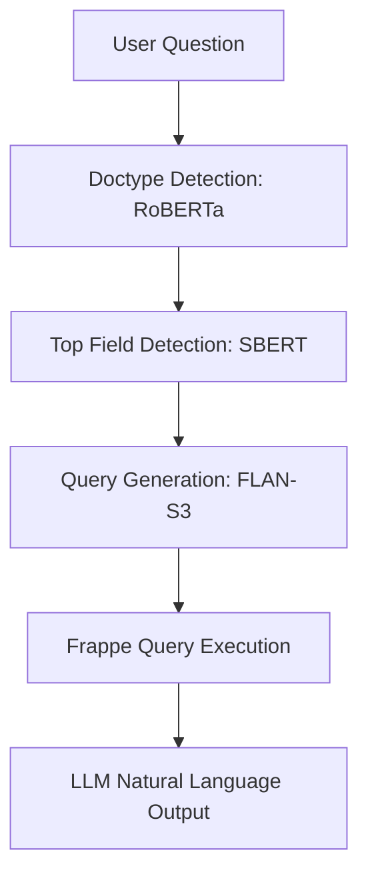

#  Changai - ERPNext Natural Language Interface

A modular AI pipeline that converts natural language questions into accurate ERPNext (Frappe) queries, executes them, and returns results in human-friendly language. Built to simplify ERP access for business users with no technical knowledge.

---

##  Overview

This system allows users to interact with ERPNext using natural questions such as:

> “Which suppliers from India are transport providers?”

The pipeline :
- Understands the user intent
- Predicts the relevant ERP doctype and fields
- Generates and executes a valid Frappe query
- Converts the response into a clear, user-friendly sentence using an LLM

Response:
> The following suppliers from India provide transport services: IndoTrans Logistics, QuickMove Carriers.

---

## Pipeline Architecture

##  Contributions

Contributions are welcome!

You can help by:
- Improving datasets or adding new question styles
- Fixing issues or bugs in the pipeline
- Enhancing query generation or accuracy

To contribute, please open an issue or submit a pull request.

## License

This project is licensed under the MIT License.  
#mit
