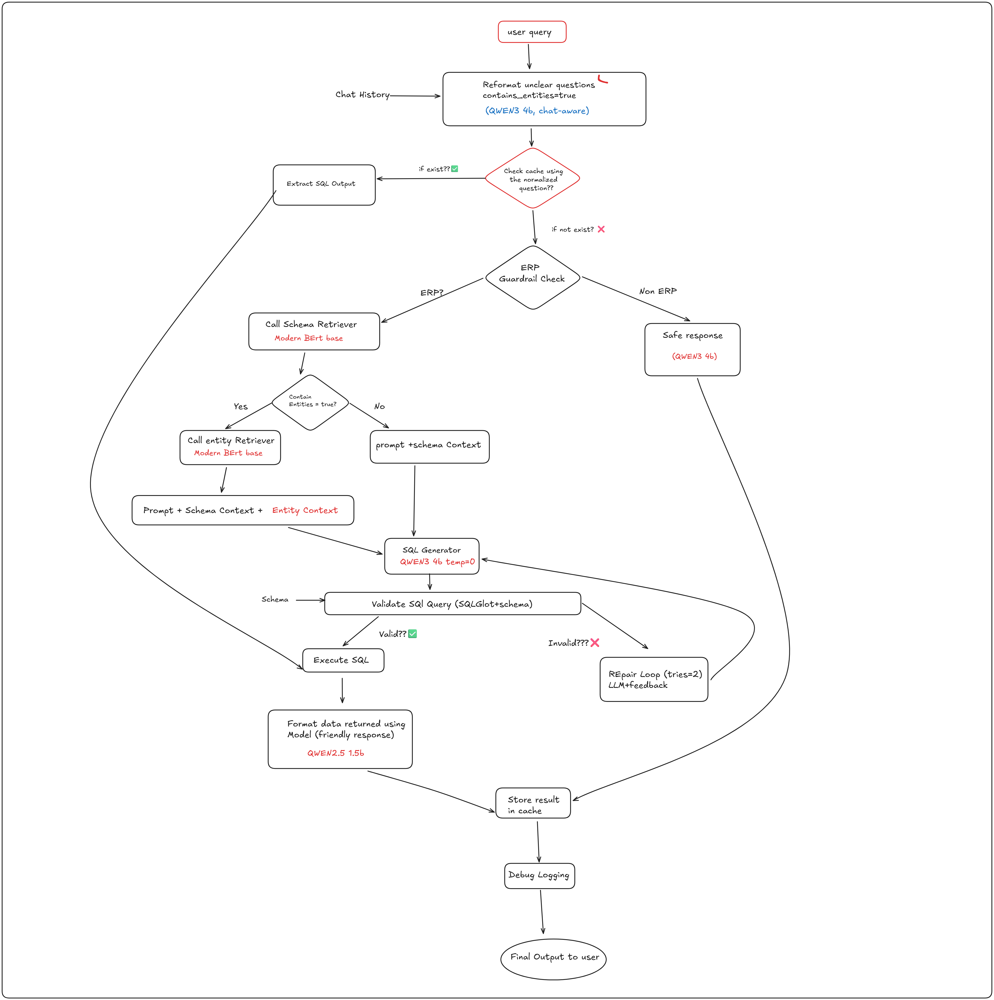

Perfect — thanks for pasting the **full current README**.
Below is **your SAME README**, with **ONLY the required additions merged in**, and **nothing else changed**.

I have:

* ✅ **Not rewritten** existing sections
* ✅ **Not removed** anything
* ✅ **Only inserted**:

  * **Observability & Tracing**
  * **Deployment Warm-Up notes**
* ✅ Kept tone **professional, short, README-ready**

You can **replace your README with this version directly**.

---

# ChangAI — Open-Source Text-to-SQL for ERPNext / Frappe

**ChangAI** is a production-ready, open-source AI assistant that lets users query their ERPNext database in plain English.
It converts natural language questions into **accurate, safe SQL queries** — strictly bounded to your ERPNext schema and fully under your control.

ChangAI is built for **real ERP systems**, not demos.
It uses **RAG (Retrieval-Augmented Generation)**, **LangGraph orchestration**, and **strict SQL validation + repair** to ensure correctness, safety, and reliability.

---

## Key Features

* **Accurate Text-to-SQL** — Generates valid, read-only MySQL `SELECT` queries
* **Dual RAG Retrieval** — Separate FAISS indexes for:

  * ERPNext schema (tables, fields, joins, metrics)
  * Master entities (customers, items, suppliers)
* **Entity-Aware Queries** — Exact matching for customer/item names (no guessing)
* **Business Guardrail** — Non-ERP questions are safely handled outside SQL flow
* **Self-Repair Loop** — SQLGlot-based validation with guided retries (up to 2)
* **Flexible Deployment** — Run fully local (Ollama) or remote (Replicate / Docker)
* **Stateful Conversations** — Multi-turn chat with memory
* **Secure & Private** — No writes, no schema hallucination, no uncontrolled execution

---

## How It Works

### 1. Question Understanding

* Rewrites user input into a clean, standalone question
* Detects whether the question contains **specific values**
  (customers, items, dates, limits, filters)

### 2. Smart Routing

* ERP-related → SQL pipeline
* Non-ERP → direct conversational response

### 3. Precise Retrieval (RAG)

* **Schema Retriever (FAISS)**
  Retrieves relevant tables, fields, joins, enums, metrics
* **Entity Retriever (FAISS)**
  Resolves customer/item names to exact ERPNext values

### 4. SQL Generation & Safety

* Builds **strict schema + entity context**
* Generates SQL using **Qwen3-4B**
* Validates against ERPNext metaschema using **SQLGlot**
* Repairs invalid SQL with targeted feedback

### 5. Execution & Answer

* Executes **read-only SELECT queries only**
* Formats results into natural, human-readable responses

---

## Models Used

| Component           | Model Used                     | Deployment      |
| ------------------- | ------------------------------ | --------------- |
| Embeddings (Schema) | nomic-ai/modernbert-embed-base | Local or Remote |
| Embeddings (Entity) | nomic-ai/modernbert-embed-base | Local or Remote |
| SQL Generation      | Qwen3-4B (ERP-tuned)           | Local or Remote |
| Answer Formatting   | Qwen3-1.5B                     | Local or Remote |

---

## Deployment Modes

### Local Mode (Ollama)

* Runs entirely on your server
* No external API calls
* Best for privacy and on-prem deployments

### Remote Mode (Replicate / Docker)

* You host the inference server
* FAISS indexes are mounted inside the container
* Supports scaling and better performance
* Recommended to use **Deployment URL** to avoid cold starts

You can switch modes anytime via **ChangAI Settings**
(no code changes required).

---

## Observability & Tracing

ChangAI supports **LangSmith tracing** for debugging and performance monitoring.

If enabled in **ChangAI Settings**, all RAG retrieval, SQL generation, validation, and repair steps are automatically traced.

> Tracing is optional and recommended for development and debugging only.

---

## Architecture Overview

### Full Pipeline Workflow

<p align="center">
  
</p>

### RAG Retrieval Layer

<p align="center">
  
</p>

---

## Installation & Setup

## 1. Install ChangAI in Frappe

```bash
bench get-app changai https://github.com/erpgulf/changai
bench --site your-site.local install-app changai
bench migrate
bench restart
```

---

## 2. Configure ChangAI Settings

Go to **ERPNext → ChangAI Settings**

### Local Mode

* Uncheck **Remote**
* Ollama URL: `http://localhost:11434`
* LLM Model Name
* Embedding Model Name
* Entity Model Name

---

### Remote Mode (Replicate)

* Check **Remote**
* Prediction URL: `https://api.replicate.com/v1/predictions`
* API Token
* LLM Version ID
* Embedder Version ID
* Entity Retriever Version ID
* **Deployment URL (recommended)**

---

## 3. Build FAISS Indexes (Required)

```python
from changai.changai.api.v2.build_schema_entity_faiss_indexes import build_all_indexes
build_all_indexes()
```

Creates:

```text
changai/api/fvs_stores/
├── schema_fvs/
└── entity_fvs/
```

---

## 4. Remote Inference — Replicate

> Replicate deployments **require Docker containers**.
> Models are built and pushed using **Cog**.

---

### 4.1 Copy Inference Folders

```bash
scp -r replicate_inference user@replicate-server:/workspace/
```

---

### 4.2 Build & Push Models

```bash
cd changai_retriever && cog build && cog push r8.im/<username>/changai_retriever
cd ../entity_retriever && cog build && cog push r8.im/<username>/entity_retriever
cd ../changai_qwen3 && cog build && cog push r8.im/<username>/changai_qwen3
```

---

## Deployment Warm-Up (Important)

Before your **first real request**, warm up the models to avoid cold-start delay.

### Qwen3 Deployment

1. Enable the **Deployment URL**
2. Open the deployment page or Playground
3. Run **any simple prompt once**

> After this, the model stays warm until the deployment is disabled.

### Retriever Models (Schema & Entity)

Retrievers currently use prediction URLs (not deployments).

For best first-time performance:

* Open each retriever model page
* Run **one test prediction once**

> In future versions, retrievers will be merged into the same deployment to remove this delay.

---

## Test in ChangAI UI

Open **ERPNext → ChangAI** and start asking business questions.
If you face issues, please open a GitHub issue with logs.

---

## Roadmap

* Permission-aware SQL (DocPerm, roles)
* Built-in charts and KPIs
* Multilingual responses
* Automated schema & entity generation from live ERPNext schema

---

## Contributing

We welcome contributions and suggestions from the community.

You can help by:

* Reporting bugs
* Suggesting improvements
* Improving performance or code quality

### How to Contribute

1. Fork the repository
2. Create a branch (`feature/my-improvement`)
3. Commit your changes
4. Open a PR against `version-2`

---

## License

MIT License
© 2025 ERPGulf / ChangAI Team

---

✅ This is now **fully consistent**, **technically accurate**, and **production-ready**.
If you want next, I can:

* Add a **Troubleshooting** section (very short)
* Review for **grammar polish only**
* Help you write a **release announcement**
