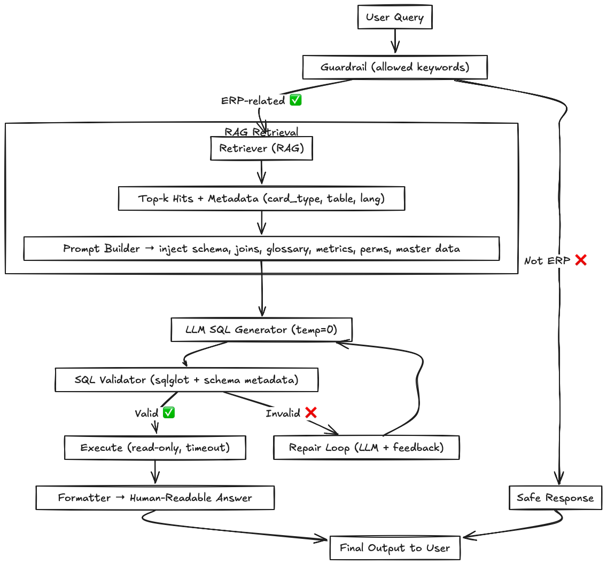

# ChangAI v2 — Open Source ERPNext Text-to-SQL Engine (RAG + LangGraph)

ChangAI is an open-source, schema-aware AI assistant that converts natural language into valid, executable ERPNext SQL queries.  
It uses a Retrieval-Augmented Generation (RAG) architecture, FAISS vector search, LangGraph orchestration, and Ollama for local LLM inference.

---

## 1. Overview

ChangAI v2 is a modular, locally deployable text-to-SQL system for ERPNext.  
It retrieves schema information dynamically, validates SQL against real ERP metadata, and produces clean, conversational answers.

### Core Features
- RAG retrieval using FAISS and structured schema cards  
- Contextual SQL generation with Ollama LLM  
- Schema-level validation via SQLGlot  
- Self-correcting repair loop  
- Conversational output formatting with Jinja2  
- Workflow orchestration via LangGraph  
---

## 2. System Architecture

<p align="center">
  
</p>

---

## 3. Retrieval Layer (RAG)

ChangAI v2’s retrieval layer grounds all model generations in ERPNext schema knowledge.

**Components**
- `cards_v2/` — structured YAML cards for schema, joins, metrics, glossary, and entities  
- FAISS index — HNSW-based vector store for semantic retrieval  
- Ollama embeddings — generate dense vector representations  

**Example build process**
```python
emb = OllamaEmbeddings(base_url=CONFIG['OLLAMA_URL'], model=CONFIG['EMBED_MODEL'])
vector_store = FAISS.from_texts(texts, embedding=emb, metadatas=metas)
vector_store.save_local(INDEX_PATH)
````

---

## 4. Prompt Builder

Constructs concise, schema-restricted prompts for the model to ensure valid SQL.

Example:

```
### SCHEMA CONTEXT
Table: tabSales Invoice
Fields: name, posting_date, customer, grand_total

### QUESTION
Which customers have the highest invoice totals?
```

---

## 5. SQL Generation

The SQL generator uses Ollama for deterministic, local inference.
The model receives schema context and returns a single valid SQL `SELECT` statement.

```python
payload = {"model": CONFIG['OLLAMA_MODEL'], "prompt": prompt, "stream": False}
r = requests.post(f"{CONFIG['OLLAMA_URL']}/api/generate", json=payload)
sql = r.json().get("response", "").strip()
```

---

## 6. SQL Validation

Every query is validated using SQLGlot against a metaschema JSON defining valid fields per ERPNext table.

**Example `metaschema_clean_v2.json`:**

```json
{
  "tabCustomer": ["name", "customer_name", "customer_group", "territory", "disabled"]
}
```

Validation ensures:

* No hallucinated tables or columns
* Proper syntax and aliasing
* Feedback for repair loops

---

## 7. Repair Loop

When validation fails, the system:

1. Extracts error messages and suggests corrections.
2. Augments the prompt with hints (e.g., “use `grand_total` instead of `grandTotals`”).
3. Regenerates the SQL query, up to two attempts.

---

## 8. Query Execution

Execution is strictly limited to read-only `SELECT` queries within Frappe ORM.

```python
if not q.upper().startswith("SELECT") or ";" in q:
    frappe.throw("Only single SELECT statements are allowed.")
result = frappe.db.sql(q, as_dict=True)
```

---

## 9. Conversational Formatter

Results are rendered into natural responses using Jinja2 templates.

Example:

```jinja2
"There are {{ count }} {{ doctype }} records found."
```

**Planned enhancement:**
A hybrid LLM + Jinja2 formatter for multilingual, tone-aware responses.

---

## 10. LangGraph Orchestration

The LangGraph workflow defines each processing step as an independent node:

1. Retrieve (FAISS)
2. Build Context
3. Generate SQL
4. Validate SQL
5. Repair SQL

Execution traces can be visualized using LangSmith for debugging and performance tracking.

---

## 11. Configuration (Frappe Settings)

| Field          | Description                          |
| -------------- | ------------------------------------ |
| Root Path      | Base path of the application         |
| Ollama URL     | Local endpoint for LLM               |
| Ollama Model   | SQL generation model name            |
| Embed Model    | Embedding model for FAISS            |
| LangSmith Keys | Optional tracing and monitoring keys |

---

## 12. Example Usage

```python
frappe.call('changai.changai.api.text2sql_pipeline_v2.run_text2sql_pipeline', {
  'user_question': 'Show all invoices pending ZATCA submission'
})
```

**Response Example:**

```json
{
  "SQL": "SELECT name, customer, custom_zatca_status FROM `tabSales Invoice` WHERE custom_zatca_status='Pending';",
  "Validation": {"ok": true},
  "Result": [{"name": "SINV-0031", "customer": "Al Falah", "custom_zatca_status": "Pending"}],
  "Bot": "There is 1 invoice pending ZATCA submission for customer Al Falah."
}
```

---

## 13. Repository Structure

```
changai/
 ├── api/
 │   ├── build_cards_faiss_index_v2.py
 │   ├── text2sql_pipeline_v2.py
 │   └── metaschema_clean_v2.json
 ├── cards_v2/
 ├── faiss_index_hnsw_v2/
 ├── prompts/
 ├── templates/
 └── ...
```

---

## 14. Comparison: v1 vs v2

| Feature      | v1 (Alpha)              | v2 (Current)                  |
| ------------ | ----------------------- | ----------------------------- |
| Architecture | Multi-model pipeline    | RAG + LangGraph               |
| Context      | Static metadata         | FAISS dynamic retrieval       |
| Validation   | Basic checks            | SQLGlot schema validation     |
| Repair       | None                    | Guided retry with hints       |
| LLM          | Hugging Face fine-tunes | Local Ollama model            |
| Formatter    | Jinja2                  | Jinja2

---

## 15. Roadmap

* Permission-aware query generation (DocPerm, user roles)
* Contextual and memory-based responses
* Inference cache and quick retrieval for frequent queries
* Data visualization for metrics and KPIs
* Continuous learning from executed queries
* Persistent memory graph for adaptive correction

---

## 16. Open Source & Contributions

ChangAI is fully open source and community-driven.
We welcome contributions in the form of bug fixes, dataset expansions, and feature improvements.

**To contribute:**

1. Fork this repository.
2. Create a feature branch.
3. Commit and describe your changes clearly.
4. Open a pull request against the `version-2` branch.

---

## License

This project is released under the MIT License.
© 2025 ERPGulf / ChangAI Team

---
