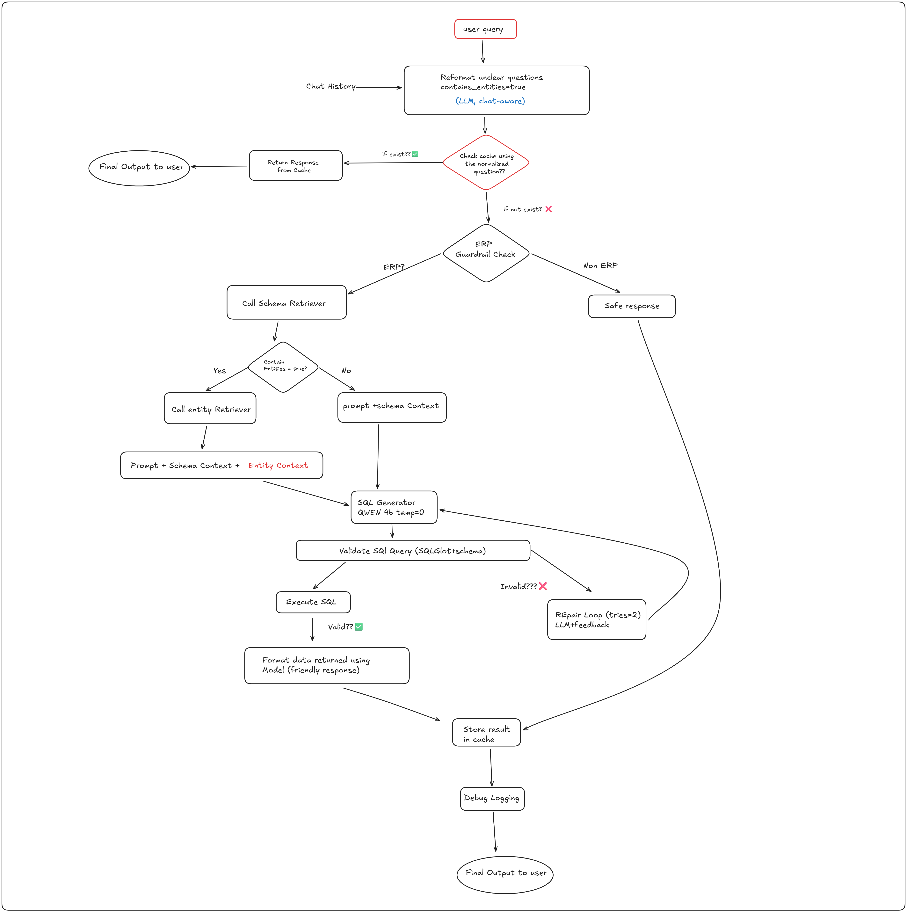

# ChangAI — Open-Source Text-to-SQL for ERPNext / Frappe

**ChangAI** is a production-ready, open-source AI assistant that lets users query their ERPNext database in plain English.  
It converts natural language questions into accurate, safe SQL queries — all while staying fully within your schema and running privately on your infrastructure.

Built with modern RAG techniques, LangGraph orchestration, and self-correcting logic, ChangAI delivers reliable answers without hallucinations.

---

## Key Features

- **Accurate Text-to-SQL** — Generates valid MySQL queries for ERPNext doctypes  
- **Advanced RAG Retrieval** — Dual FAISS indexes: one for schema, one for entities  
- **Entity-Aware Queries** — Detects specific customers, items, or references and applies exact filters  
- **Business Guardrail** — Routes non-ERP questions (e.g., "How are you?") to safe, direct responses  
- **Self-Repair Loop** — Automatically fixes invalid SQL using SQLGlot validation + targeted hints (up to 2 retries)  
- **Flexible Deployment** — Runs locally via Ollama **or** on your remote inference server (Replicate or custom endpoint)  
- **Stateful Conversations** — Multi-turn chat with memory and context  
- **Secure & Private** — No data leaves your server in local mode; full control in remote mode  

---

## How It Works

### 1. Question Understanding
- Rewrites user input into a clear, standalone question
- Detects if specific values (e.g., customer names, item codes) are mentioned

### 2. Smart Routing
- Checks for business keywords
- ERP-related → proceeds to SQL pipeline  
- General chat → direct LLM response

### 3. Precise Retrieval
- **Schema Retriever** (FAISS): Finds relevant tables, fields, joins, metrics
- **Entity Retriever** (FAISS): Matches mentioned customers/items to exact codes

### 4. SQL Generation & Safety
- Builds clean schema + entity context
- Generates SQL using **Qwen3-4B** (fine-tuned on synthetic ERP data)
- Validates with **SQLGlot** against real ERPNext metaschema
- If invalid → automatic repair with precise feedback

### 5. Execution & Answer
- Executes read-only `SELECT` queries
- Formats results into natural, conversational responses

---

## Models Used

| Component              | Model Used                                      | Deployment                          |
|------------------------|-------------------------------------------------|-------------------------------------|
| Embeddings (Retrieval) | nomic-ai/modernbert-embed-base                  | Local Ollama **or** Remote Server   |
| SQL Generation         | Qwen3-4B (fine-tuned on synthetic ERPNext data) | Local Ollama **or** Remote Server   |
| Entity Retrieval       | nomic-ai/modernbert-embed-base                  | Local Ollama **or** Remote Server   |
| Answer Formatting      | Qwen3-1.5B                                      | Local Ollama **or** Remote Server   |

You have full flexibility:  
- **Local mode** — Everything runs on your server via Ollama (maximum privacy, no external calls)  
- **Remote mode** — Use your own hosted inference server (e.g., Replicate or self-hosted) for better performance or scaling

Switch between them instantly in **ChangAI Settings** — no code changes needed.

---
## Architecture Overview

### Full Pipeline Workflow
<p align="center">
  
</p>
*End-to-end flow: question rewriting → guardrail routing → dual retrieval → context building → SQL generation → validation → self-repair → execution → natural language response*

### RAG Retrieval Layer
<p align="center">
  
</p>
*Dual FAISS indexes: one for schema (tables, fields, joins, metrics) and one for master entities (customers, items, suppliers)*


## Installation & Setup

1. Install the app in your Frappe bench:
   ```bash
   bench get-app changai https://github.com/erpgulf/changai
   bench --site your-site.local install-app changai
   ```

2. Go to **ChangAI Settings** and choose your mode:
   - **Local**: Enter your Ollama URL (usually `http://localhost:11434`)
   - **Remote**: Enter your server URL, API token, and model version IDs

3. Build FAISS indexes (one-time):
   ```python
   from changai.changai.api.v2.build_index import build_all_indexes
   build_all_indexes()
   ```

---

## Usage Example

```python
frappe.call("changai.changai.api.v2.text2sql_pipeline.run_text2sql_pipeline", 
    user_question="Top 5 customers by sales this month",
    chat_id="session-123")
```

**Response:**
```json
{
  "SQL": "SELECT customer, SUM(base_grand_total) AS total ...",
  "Result": [...],
  "Bot": "Here are your top 5 customers this month:\n1. Al Falah Trading - $124,500\n2. Gulf Supplies - $98,200\n..."
}
```

---

## Why ChangAI Stands Out

- **No hallucinations** — Strict validation + repair loop
- **Entity precision** — Never guesses customer/item names
- **Deployment freedom** — Local Ollama for privacy, remote server for speed
- **Real-world ready** — Built and tested on live ERPNext instances

---

## Roadmap

- Permission-aware SQL (respect user roles)
- Built-in charts and visualizations
- Query caching
- Feedback-based continuous improvement
- Multilingual support

---

## Contributing

Contributions are welcome!  
Whether it's new schema cards, bug fixes, performance tweaks, or features — we’d love your help.

1. Fork the repo
2. Create a branch (`feature/my-improvement`)
3. Submit a PR to `version-2`

---

## License

MIT License — free for commercial and personal use.

**© 2025 ERPGulf & ChangAI Community**

Made with ❤️ for the ERPNext ecosystem.  
Simple. Reliable. Yours.

## 2. System Architecture

<p align="center">
  
</p>
---

## 3. Retrieval Layer (RAG)

ChangAI v2’s retrieval layer grounds all model generations in ERPNext schema knowledge.

**Components**
- `cards_v2/` — structured YAML cards for schema, joins, metrics, glossary, and entities  
- FAISS index — HNSW-based vector store for semantic retrieval  
- Ollama embeddings — generate dense vector representations  

**Example build process**
```python
emb = OllamaEmbeddings(base_url=CONFIG['OLLAMA_URL'], model=CONFIG['EMBED_MODEL'])
vector_store = FAISS.from_texts(texts, embedding=emb, metadatas=metas)
vector_store.save_local(INDEX_PATH)
````

---

## 4. Prompt Builder

Constructs concise, schema-restricted prompts for the model to ensure valid SQL.

Example:

```
### SCHEMA CONTEXT
Table: tabSales Invoice
Fields: name, posting_date, customer, grand_total

### QUESTION
Which customers have the highest invoice totals?
```

---

## 5. SQL Generation

The SQL generator uses Ollama for deterministic, local inference.
The model receives schema context and returns a single valid SQL `SELECT` statement.

```python
payload = {"model": CONFIG['OLLAMA_MODEL'], "prompt": prompt, "stream": False}
r = requests.post(f"{CONFIG['OLLAMA_URL']}/api/generate", json=payload)
sql = r.json().get("response", "").strip()
```

---

## 6. SQL Validation

Every query is validated using SQLGlot against a metaschema JSON defining valid fields per ERPNext table.

**Example `metaschema_clean_v2.json`:**

```json
{
  "tabCustomer": ["name", "customer_name", "customer_group", "territory", "disabled"]
}
```

Validation ensures:

* No hallucinated tables or columns
* Proper syntax and aliasing
* Feedback for repair loops

---

## 7. Repair Loop

When validation fails, the system:

1. Extracts error messages and suggests corrections.
2. Augments the prompt with hints (e.g., “use `grand_total` instead of `grandTotals`”).
3. Regenerates the SQL query, up to two attempts.

---

## 8. Query Execution

Execution is strictly limited to read-only `SELECT` queries within Frappe ORM.

```python
if not q.upper().startswith("SELECT") or ";" in q:
    frappe.throw("Only single SELECT statements are allowed.")
result = frappe.db.sql(q, as_dict=True)
```

---

## 9. Conversational Formatter

Results are rendered into natural responses using Jinja2 templates.

Example:

```jinja2
"There are {{ count }} {{ doctype }} records found."
```

**Planned enhancement:**
A hybrid LLM + Jinja2 formatter for multilingual, tone-aware responses.

---

## 10. LangGraph Orchestration

The LangGraph workflow defines each processing step as an independent node:

1. Retrieve (FAISS)
2. Build Context
3. Generate SQL
4. Validate SQL
5. Repair SQL

Execution traces can be visualized using LangSmith for debugging and performance tracking.

---

## 11. Configuration (Frappe Settings)

| Field          | Description                          |
| -------------- | ------------------------------------ |
| Root Path      | Base path of the application         |
| Ollama URL     | Local endpoint for LLM               |
| Ollama Model   | SQL generation model name            |
| Embed Model    | Embedding model for FAISS            |
| LangSmith Keys | Optional tracing and monitoring keys |

---

## 12. Example Usage

```python
frappe.call('changai.changai.api.text2sql_pipeline_v2.run_text2sql_pipeline', {
  'user_question': 'Show all invoices pending ZATCA submission'
})
```

**Response Example:**

```json
{
  "SQL": "SELECT name, customer, custom_zatca_status FROM `tabSales Invoice` WHERE custom_zatca_status='Pending';",
  "Validation": {"ok": true},
  "Result": [{"name": "SINV-0031", "customer": "Al Falah", "custom_zatca_status": "Pending"}],
  "Bot": "There is 1 invoice pending ZATCA submission for customer Al Falah."
}
```

---

## 13. Repository Structure

```
changai/
 ├── api/
 │   ├── build_cards_faiss_index_v2.py
 │   ├── text2sql_pipeline_v2.py
 │   └── metaschema_clean_v2.json
 ├── cards_v2/
 ├── faiss_index_hnsw_v2/
 ├── prompts/
 ├── templates/
 └── ...
```

---

## 14. Comparison: v1 vs v2

| Feature      | v1 (Alpha)              | v2 (Current)                  |
| ------------ | ----------------------- | ----------------------------- |
| Architecture | Multi-model pipeline    | RAG + LangGraph               |
| Context      | Static metadata         | FAISS dynamic retrieval       |
| Validation   | Basic checks            | SQLGlot schema validation     |
| Repair       | None                    | Guided retry with hints       |
| LLM          | Hugging Face fine-tunes | Local Ollama model            |
| Formatter    | Jinja2                  | Jinja2

---

## 15. Roadmap

* Permission-aware query generation (DocPerm, user roles)
* Contextual and memory-based responses
* Inference cache and quick retrieval for frequent queries
* Data visualization for metrics and KPIs
* Continuous learning from executed queries
* Persistent memory graph for adaptive correction

---

## 16. Open Source & Contributions

ChangAI is fully open source and community-driven.
We welcome contributions in the form of bug fixes, dataset expansions, and feature improvements.

**To contribute:**

1. Fork this repository.
2. Create a feature branch.
3. Commit and describe your changes clearly.
4. Open a pull request against the `version-2` branch.

---

## License

This project is released under the MIT License.
© 2025 ERPGulf / ChangAI Team

---
